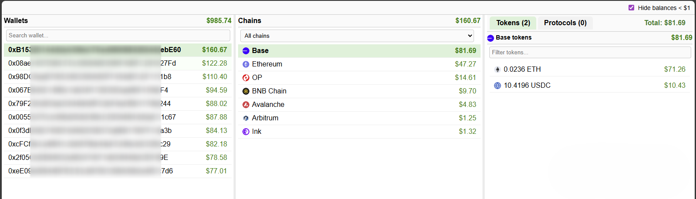

<!-- Переключатель языков -->
[](README.md)
[](README.ru.md)

# 💰 Debank balance checker (EVM/Solana)

Скрипт автоматически собирает данные о кошельках из Debank и выводит результат в HTML-страницу.



Поддерживает:
- Асинхронный парсинг в несколько потоков 🧩
- Работа через прокси 🌍
- Автоматическую генерацию HTML-страницы с данными 📊
- Автообновление данных каждые N минут 🔁


## 🛠 Установка

1. Клонируй или скопируй проект

```bash
git clone https://github.com/damirnabis/debank-balance-checker.git
```
```bash
cd debank-balance-checker
```

2. Создай и активируй виртуальное окружение (рекомендуется)

```bash
python -m venv venv
```
```bash
venv\Scripts\activate    # для Windows
```
```bash          
source venv/bin/activate # для macOS/Linux
```

3. Установи зависимости

```bash
pip install -r requirements.txt
```
```bash
playwright install
```


## ⚙️ Настройки

1. Заполни файл data\addresses.txt публичными адресами EVM и/или Solana кошельков.

2. Опционально: для запуска скрипта в несколько потоков заполни файл data\proxies.txt прокси.

3. Параметры в config.py:

- MAX_CONCURRENT = 10       - количество потоков
- UPDATE_DATA_MIN = 15      - интервал обновления данных (мин)
- UPDATE_HTML_SEC = 60      - интервал обновления HTML (сек)


## 🚀 Запуск

```bash
python main.py
```


## После старта:

1. При первом запуске начнется сбор данных по кошелькам из Debank с выводом прогресса.
2. Автоматически откроется results.html — страница браузера с балансами и списками кошельков.

⏱ Автообновление

- HTML-страница обновляется каждые UPDATE_HTML_SEC секунд.
- Данные с Debank обновляются каждые UPDATE_DATA_MIN минут.


## 🧩 Горячие клавиши
 
Ctrl+C	Завершает все процессы и закрывает Playwright


## 📊 Результат

После запуска будет автоматически создан файл results.html с отображением всех кошельков, сетей, токенов и DeFi-проектов, включая их текущий баланс в USD.